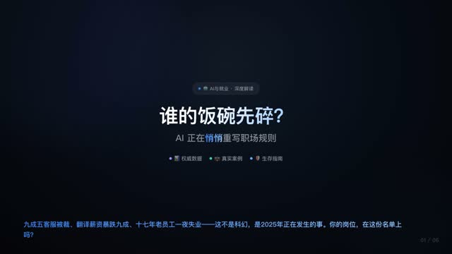
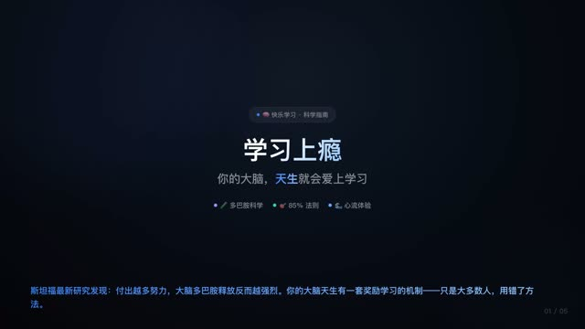
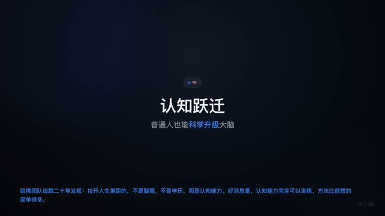
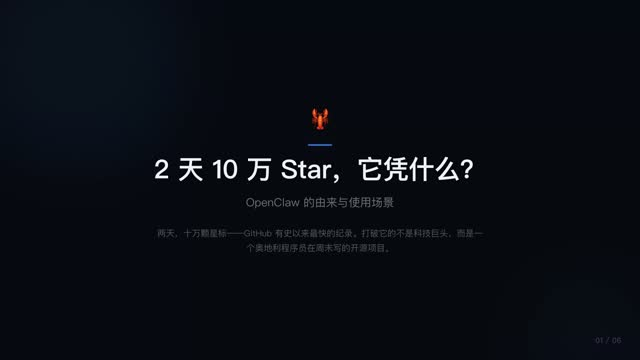
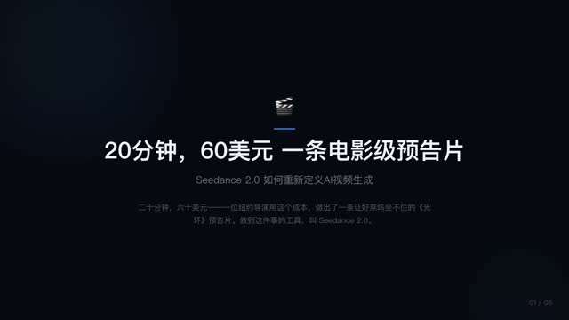
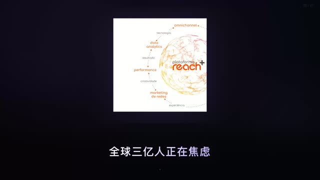
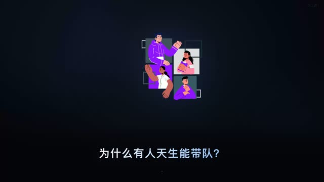
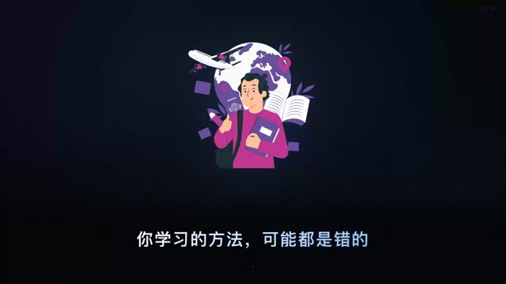

# Video Skills

**Cursor Skills 合集** — 一句话生成短视频。在 Cursor 中用自然语言驱动 AI 自动完成调研、文案、配音、动画、合成全流程。

## Skills 一览

| Skill | 说明 | 触发方式 |
|-------|------|----------|
| **[tumblr-video](skills/tumblr-video/)** | Tumblr 风格逐行揭示视频，TTS 配音 + Minecraft 跑酷背景 | `制作一个 tumblr 视频` |
| **[knowledge-video](skills/knowledge-video/)** | 知识讲解视频：调研→撰稿→PPT→TTS→逐段合成 | `做一个关于XX的科普视频` |
| **[svg-video](skills/svg-video/)** | Lottie 动画讲解视频：自动搜索动画素材 + HTML 渲染 + 配音合成 | `做一个XX的动画讲解视频` |
| **[coze-upload](skills/coze-upload/)** | 上传本地文件到云端，获取可访问 URL | `上传这个文件` |
| **[xskill-api](skills/xskill-api/)** | xskill.ai API 调用：图片/视频生成、语音合成等 | `用 xskill 生成图片` |

## 快速开始

### 安装到 Cursor

将本仓库克隆到项目的 `.cursor/skills/` 目录下，即可在 Cursor Agent 中使用所有 skills：

```bash
git clone https://github.com/hexiaochun/video_skills.git .cursor/skills/video_skills
```

或只安装单个 skill：

```bash
# 例如只安装 tumblr-video
cp -r video_skills/skills/tumblr-video .cursor/skills/
```

### 前置依赖

- **Python 3.10+**
- **FFmpeg** — `brew install ffmpeg`
- Python 依赖：

```bash
pip install playwright edge-tts Pillow
playwright install chromium
```

## 使用方式

安装后在 Cursor Agent 聊天中直接用自然语言描述即可，例如：

> "做一个关于量子计算的科普视频"

> "制作一个 tumblr 风格的视频，讲讲为什么程序员讨厌夏令时"

> "用 Lottie 动画做一个焦虑管理的讲解短视频"

Agent 会自动识别并调用对应的 skill，完成从文案到成片的全流程。

## 视频案例

以下是使用不同 Skills 生成的真实视频案例（一句提示词 → 全自动成片）：

### knowledge-video 知识讲解

#### 🤖 AI 取代岗位

> 提示词：做一个关于 AI 取代哪些岗位的科普视频

自动调研 → 数据引用 → PPT 逐页讲解，涵盖客服裁员、翻译薪资暴跌等真实案例

[](https://github.com/hexiaochun/video_skills/blob/main/demos/ai-replace-jobs.mp4)

#### 🧠 快乐学习指南

> 提示词：做一个关于如何快乐学习的科普视频

引用《自然》杂志多巴胺研究，讲解 85% 法则与心流体验

[](https://github.com/hexiaochun/video_skills/blob/main/demos/happy-learning.mp4)

#### 🧠 认知跃迁

> 提示词：做一个关于普通人提升认知能力的视频

从运动、睡眠到元认知训练，基于哈佛 20 年追踪研究

[](https://github.com/hexiaochun/video_skills/blob/main/demos/cognition-upgrade.mp4)

#### 🦞 OpenClaw 解读

> 提示词：做一个介绍 OpenClaw 项目的视频

2 天 10 万 Star 的开源项目深度解读，含自定义插图

[](https://github.com/hexiaochun/video_skills/blob/main/demos/openclaw.mp4)

#### 🎬 Seedance 2.0

> 提示词：做一个关于 Seedance 2.0 的科普视频

AI 视频生成技术解读：双分支扩散 Transformer 架构

[](https://github.com/hexiaochun/video_skills/blob/main/demos/seedance2.mp4)

### svg-video Lottie 动画讲解

#### 😌 焦虑管理

> 提示词：用 Lottie 动画做一个焦虑管理的讲解短视频

21 个动画片段，自动搜索 LottieFiles 匹配素材，逐句配音

[](https://github.com/hexiaochun/video_skills/blob/main/demos/anxiety-lottie.mp4)

#### 👑 统帅能力

> 提示词：做一个关于提升统帅能力的动画讲解视频

Lottie 动画 + 短句文案，领导力提升方法论

[](https://github.com/hexiaochun/video_skills/blob/main/demos/leadership-lottie.mp4)

#### 📚 高效学习

> 提示词：做一个关于高效学习方法的动画视频

SVG/Lottie 双版本，涵盖遗忘曲线、主动回忆、间隔重复等策略

[](https://github.com/hexiaochun/video_skills/blob/main/demos/learning-lottie.mp4)

## 输出格式

- 分辨率：1080p（知识视频）/ 1440×2560 竖版（Tumblr 视频）
- 格式：MP4 / WebM
- 适合发布：抖音、快手、小红书、TikTok、YouTube Shorts

## License

MIT
